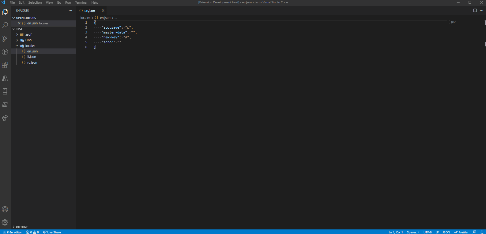

# Json Consolidator

`json-consolidator` is an extension that helps to edit similarly structured json files. Especially handy for `i18n` files. At the moment supported and tested only on 1-dimensional (flat) json files.

## Installation

* Download `vsix` file from [VS Code Marketplace](https://marketplace.visualstudio.com/items?itemName=Exxend.json-consolidator)
Or
* Search for `Exxend.json-consolidator` in `Extensions` tab of VS Code

## Features

* Edit simultaneously multiple json files
* Search along the opened files
* Validation of json keys on save
* Filter by items in error

## Trigger extension

To open editor window of `json-consolidator` you just need to right click on target foldet containing json files and select `Json Consolidator - Editor`. Extension will automatically scan for all json files present and display them in editor. Since originally extensions is developed to edit `i18n` files, default directories where extension could be triggered are `i18n` and `locales`, it could be changed be means of extension configuration keys.

## Configuration

This extension contributes the following settings:

* `json-consolidator.orderKeysOnSave` - default `true` - Controls wether json file keys should be ordered on save
* `json-consolidator.orderKeysDirection` - default `Ascending` - Ordering direction of json keys
* `json-consolidator.triggerEverywhere` - default `false` - Controls wether extension could be triggered from any directory, if false triggered only at `json-consolidator.supportedDirectories`
* `json-consolidator.supportedDirectories` - default `[ "i18n", "locales" ]` - Names of directories where extension could be triggered
* `json-consolidator.targetEditorWindow` - default `Two` - Controls in what tab editor should be opened
* `json-consolidator.suppressInitNotification` - default `false` -Controls wether initialization notification is shown during vscode startup

## Known Issues

* Extension does not keep track if files that are currently under edit were modified externally.
* Each time you hit save - all files will be overwritten.
* Not tested on large json files

> Tip: always use `json-consolidator` with files insige `git` repo, or make sure to have backups of the files. Even though no issues of losing data were reported - it won't hurt to be more safe!

## Credits

Inspired by [vsce-i18n-json-editor](https://github.com/thibault-vanderseypen/vsce-i18n-json-editor)
